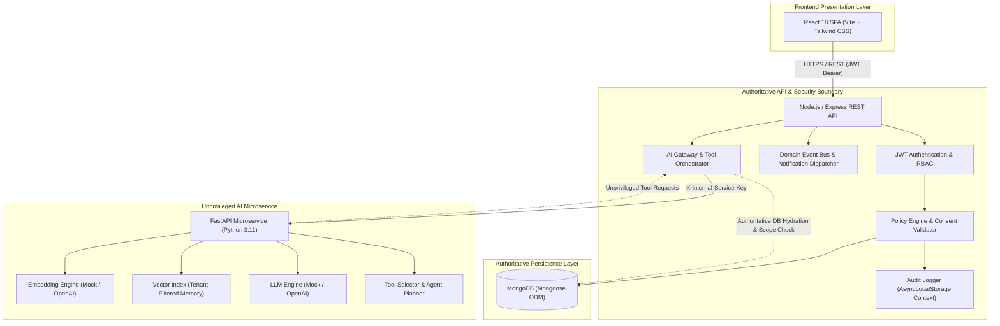

# HealthBridge — Multi-Hospital Medical Records & AI Copilot

> **Portfolio Demonstration Project**: HealthBridge is a full-stack healthcare platform demonstrating secure, role-based medical-data access and authorization-aware AI retrieval across hospitals using synthetic data.

[-teal.svg)](#current-implementation-status)
[](#technology-stack)
[](#technology-stack)
[](#technology-stack)
[](#technology-stack)
[](#technology-stack)
[](#technology-stack)
[](#automated-regression-verification)

---

## Important Project Scope & Clinical Disclaimer

> [!NOTE]
> **Portfolio & Educational Demonstration**: HealthBridge is an engineering portfolio project built for architectural demonstrations and technical interviews. All patient identities, hospitals, medical encounters, and test results are **entirely synthetic**.
> 
> - **Not HIPAA / ABDM Compliant**: This system does not claim formal regulatory certification or compliance.
> - **Not a Diagnostic Tool**: The Clinical AI Copilot performs retrieval and summarization of authorized records only. It does not provide medical diagnosis, clinical treatment advice, or automated prescriptions.
> - **Zero-PHI Design**: System audit logs and AI metadata strictly exclude protected health information and sensitive query text.

---

## Key Completed Features

- **JWT Authentication & RBAC**: 4 platform roles (`SYSTEM_ADMIN`, `HOSPITAL_ADMIN`, `DOCTOR`, `PATIENT`) with stateless JWT auth and bcrypt password hashing.
- **Hospital Lifecycle Governance**: Multi-tenant facility registration, approval, rejection, and suspension state machine.
- **Patient Memberships**: Unique patient identification (`PAT-XXXXXX`), demographics, and facility membership state machines.
- **Doctor Credentials & Multi-Hospital Affiliations**: Medical licensing verification and multi-facility clinical affiliations.
- **Doctor–Patient Assignments**: Explicit clinical relationship model enforcing facility tenant isolation.
- **Unified Medical Records Domain**: 6 Mongoose discriminator record types (`VISIT`, `DIAGNOSIS`, `MEDICATION`, `LAB_RESULT`, `PRESCRIPTION`, `DOCUMENT`) with field immutability and historical preservation.
- **Cross-Hospital Access & Granular Patient Consent**: 12-invariant access request gate, real-time dynamic consent status (`ACTIVE`, `EXPIRED`, `REVOKED`), granular clinical scopes, and immediate patient revocation.
- **Administrative Clinical Exclusion**: Platform and Hospital Administrators are strictly excluded from viewing raw medical records (`403 Forbidden: ADMIN_CLINICAL_ACCESS_RESTRICTED`).
- **Tamper-Resistant Audit Logging**: Immutable audit trail with ambient correlation IDs (`AsyncLocalStorage`), deep recursive payload sanitization, and facility-isolated read queries.
- **Real-Time Notifications & Event Bus**: Decoupled domain event bus delivering recipient-isolated clinical status notifications.
- **Appointment & Clinical Scheduling**: Multi-actor scheduling lifecycle with overlap collision prevention.
- **Semantic Clinical Search**: Vector similarity search using deterministic chunking across 6 record discriminators.
- **RAG Clinical Assistant**: Grounded question-answering strictly from authorized patient records with source citations.
- **Controlled Clinical Tool Calling**: Deterministic 2-stage pipeline with 6 read-only clinical tools and strict server-side parameter validation.
- **Bounded Agent Orchestration**: Multi-step clinical reasoning state machine with step caps (max 4 steps, max 4 tools, 15s timeout) and Express-governed citation verification.
- **Automated AI Evaluation Suite**: Deterministic test suite verifying retrieval accuracy, authorization barriers, and LLM context isolation.

---

## System Architecture

HealthBridge enforces an **authoritative authorization boundary** at the Express API layer. The React frontend never interacts directly with the AI microservice or vector store, and the AI microservice does not independently grant access to clinical data.



---

## Security & Authorization Model

HealthBridge operates on a **zero-trust clinical authorization** philosophy:

```text
The AI copilot can ONLY reason over medical records that the
requesting user is already independently authorized to access.
```

1. **Express Is Authoritative**: All database reads, updates, and tool invocations are checked by Express policies. The AI service receives only sanitized, already-authorized records.
2. **9-Step Clinical Authority Chain**: To view a patient's record, a doctor must satisfy:
   `Doctor Account → Active Profile → Approved Hospital → Active Doctor Affiliation → Valid Patient → Active Patient Membership → Active Doctor Assignment OR Active Patient Consent Scope`.
3. **Administrative Clinical Restriction**: Hospital and System Administrators have full visibility into organizational metadata and audit trails, but are hard-blocked (`ADMIN_CLINICAL_ACCESS_RESTRICTED`) from reading patient medical records.
4. **Dynamic Consent Evaluation**: Patient consent status is computed dynamically in real time. When a patient revokes consent, access is cut off immediately on the very next HTTP request without relying on asynchronous background jobs.
5. **Prompt Injection & Overriding Defenses**: Medical record contents and user questions are treated strictly as isolated data values. System override prompts and instruction escapes are neutralized.
6. **Zero-PHI Audit Invariant**: Audit records and AI metadata log operation type, record counts, and timestamps. Queries, symptom text, and diagnostic notes are strictly excluded.

---

## Clinical AI & Agent Pipeline

### 1. Retrieval-Augmented Generation (RAG) Flow
```text
Clinical Records (MongoDB)
          ↓
Deterministic Structured Chunking (6 Discriminators)
          ↓
Embedding Generation (FastAPI)
          ↓
Vector Similarity Retrieval (FastAPI)
          ↓
Express Authorization & Consent Scope Filtering
          ↓
Authoritative MongoDB Record Hydration
          ↓
Grounded Context Assembly
          ↓
LLM Synthesis & Source Citations
          ↓
Grounded Clinical Summary
```

### 2. Bounded Multi-Step Agent Flow
```text
User Clinical Question
          ↓
Agent State Machine: INITIALIZED → PLANNING
          ↓
FastAPI Plans Tool Call (e.g. get_recent_visits)
          ↓
Express Authorization Gate & Parameter Validation
          ↓
Express Executes Read-Only Query on MongoDB
          ↓
Agent State Machine: EVALUATING → NEXT STEP
          ↓
Citation Verification (Express strips unverified IDs)
          ↓
Final Grounded Answer with Interactive Citations
```

---

## Automated AI Evaluation Suite

HealthBridge includes a fully automated deterministic AI evaluation suite verifying retrieval metrics and security boundaries using synthetic clinical fixtures:

```text
======================================================================
HEALTHBRIDGE AI EVALUATION SUITE RESULTS
======================================================================
Total Evaluation Cases : 31
Passed Cases           : 31
Failed Cases           : 0
Overall Pass Rate      : 100.0%

RETRIEVAL PERFORMANCE METRICS:
  Precision            : 100.0%
  Recall               : 100.0%
  Hit Rate             : 100.0%

CRITICAL SECURITY PROOF:
  Unauthorized Records in LLM Context : 0 (100% Isolated)
======================================================================
```

> **Evaluation Caveat**: These metrics reflect automated tests against deterministic synthetic clinical cases and demonstrate structural authorization boundaries, not universal diagnostic accuracy.

---

## Technology Stack

| Layer | Technology | Version | Purpose |
|---|---|---|---|
| **Frontend** | React | 18.3.1 | Single-page application with role-aware navigation |
| **Tooling** | Vite | 6.0.11 | Fast frontend bundler and local dev server |
| **Styling** | Tailwind CSS | 3.4.17 | Clean, modern clinical design system |
| **Icons** | Lucide React | 0.475.0 | Medical and UI iconography |
| **Backend** | Node.js / Express | 22.x / 4.21.2 | REST API & authoritative authorization boundary |
| **Database** | MongoDB / Mongoose | 8.9.5 | Document database with discriminators & compound indexes |
| **Validation** | Zod | 3.24.1 | Strict backend schema validation |
| **Authentication**| JWT / bcrypt | 9.0.3 / 6.0.0 | Stateless Bearer token security & password hashing |
| **AI Service** | FastAPI (Python) | 0.110+ (3.11) | High-performance embedding, vector search, & LLM service |
| **Schema (AI)** | Pydantic | 2.6+ | Python request/response contract validation |
| **Testing (Node)**| Jest / Supertest | 29.7.0 / 7.0.0 | 17 backend test suites (382 automated tests) |
| **Testing (AI)** | Pytest / HTTPX | 8.0+ / 0.27+ | 37 microservice tests |

---

## Repository Structure

```text
healthbridge/
├── .env.example                          # Master environment configuration reference
├── README.md                             # Project overview & architectural guide
├── package.json                          # Monorepo orchestration scripts
├── docs/                                 # Architectural specifications & phase documentation
│   ├── demo-scenario.md                  # 13-step portfolio demonstration guide
│   ├── phase1-foundation.md              # Phase 1 monorepo foundation
│   ├── phase2-authentication.md          # Phase 2 auth & RBAC
│   ├── phase3-hospitals.md               # Phase 3 hospital lifecycle
│   ├── phase4-patients-memberships.md     # Phase 4 patients & memberships
│   ├── phase5-doctors.md                 # Phase 5 doctors & affiliations
│   ├── phase6-assignments.md             # Phase 6 doctor-patient assignments
│   ├── phase7-medical-records.md         # Phase 7 discriminator medical records
│   ├── phase8-cross-hospital-consent.md  # Phase 8 cross-hospital consent & access requests
│   ├── phase9-audit-logging.md           # Phase 9 immutable audit trail
│   ├── phase10-notifications.md          # Phase 10 notifications & event bus
│   ├── phase11-appointments.md           # Phase 11 clinical scheduling
│   ├── phase12-embeddings-semantic-search.md # Phase 12 vector search & embeddings
│   ├── phase13-rag-clinical-assistant.md # Phase 13 RAG clinical assistant
│   ├── phase14-tool-calling.md           # Phase 14 controlled clinical tool calling
│   ├── phase15-controlled-agent-orchestration.md # Phase 15 multi-step agent orchestrator
│   └── phase16-ai-evaluation.md          # Phase 16 automated evaluation suite
├── backend/
│   ├── .env.example                      # Backend environment template
│   ├── package.json                      # Express dependencies & scripts
│   ├── jest.config.js                    # Jest test runner configuration
│   ├── src/
│   │   ├── server.js                     # Server entry point
│   │   ├── app.js                        # Express application & middleware stack
│   │   ├── models/                       # 14 Mongoose models & discriminators
│   │   ├── controllers/                  # Route controllers
│   │   ├── services/                     # Business logic services
│   │   ├── policies/                     # Authorization & security policy rules
│   │   ├── validators/                   # Zod schema validation
│   │   ├── middleware/                   # Context, Auth, Error middleware
│   │   └── ai/                           # AI gateway, tool executor, agent, evaluation
│   │       ├── clinicalAssistantGateway.js # AI microservice client
│   │       ├── clinicalToolRegistry.js     # 6 clinical data tools
│   │       ├── clinicalToolExecutor.js     # Pre-execution authorization & query
│   │       ├── agentOrchestrator.js        # Bounded multi-step state machine
│   │       └── evaluation/                 # Phase 16 evaluation dataset & runner
│   └── tests/                            # 17 Jest test suites (382 tests)
├── ai-service/
│   ├── .env.example                      # FastAPI environment template
│   ├── requirements.txt                  # Python dependencies
│   ├── app/
│   │   ├── main.py                       # FastAPI application & router
│   │   ├── config/                       # Pydantic settings
│   │   ├── models/                       # Document & vector schemas
│   │   ├── services/                     # Chunking, vector index, RAG, agent
│   │   └── providers/                    # Mock & OpenAI Embedding/LLM providers
│   └── tests/                            # 37 Pytest unit & integration tests
└── frontend/
    ├── .env.example                      # Frontend environment template
    ├── package.json                      # React & Vite dependencies
    ├── vite.config.js                    # Vite bundler configuration
    ├── tailwind.config.js                # Tailwind CSS configuration
    └── src/
        ├── App.jsx                       # Main application shell & role navigator
        ├── components/                   # 25+ modular UI components
        └── services/                     # API client & token storage
```

---

## Getting Started

### 1. Prerequisites
- **Node.js**: v18+ (tested with v22.14)
- **Python**: v3.10+ (tested with v3.11)
- **MongoDB**: Running locally on `mongodb://localhost:27017`

### 2. Installation

```bash
# 1. Install root & Node dependencies
npm run install:all

# 2. Install Python AI Microservice dependencies
cd ai-service
pip install -r requirements.txt
cd ..
```

### 3. Environment Setup

```bash
# Create local configuration files from examples
cp .env.example backend/.env
cp ai-service/.env.example ai-service/.env
cp frontend/.env.example frontend/.env
```

### 4. Running the Services

Open three terminal windows (or use root script):

```bash
# Terminal 1: AI Microservice (http://localhost:8000)
cd ai-service
python -m uvicorn app.main:app --port 8000 --reload

# Terminal 2: Express REST API (http://localhost:5000)
cd backend
npm run dev

# Terminal 3: React Frontend (http://localhost:5173)
cd frontend
npm run dev
```

---

## Automated Regression Verification

### Backend Jest Test Suite (382 tests, 17 suites)
```bash
cd backend
npm test -- --runInBand --forceExit
```

### AI Service Pytest Suite (37 tests)
```bash
cd ai-service
pytest tests/ -v
```

### Frontend Production Build
```bash
cd frontend
npm run build
```

---

## Live Demonstration Guide

To walk through a complete cross-hospital consent and AI retrieval demonstration during an interview or portfolio presentation, follow the step-by-step guide:

📖 **[Full Demonstration Scenario Guide](docs/demo-scenario.md)**
