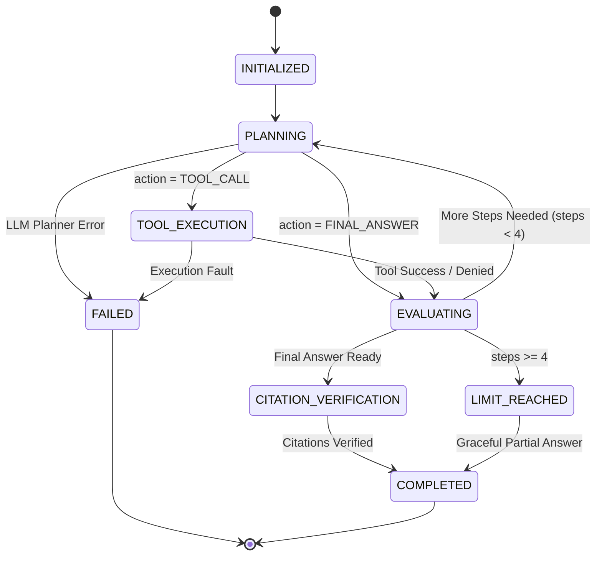

# HealthBridge — Phase 15: Controlled Agent Orchestration & Multi-Step Workflows

## 1. Architecture Overview

Phase 15 evolves the Phase 14 single-step tool calling into a bounded, deterministic, multi-step orchestration pipeline.
Rather than giving an LLM autonomous database access or unrestricted looping capabilities, the orchestration loop is strictly governed by a server-side state machine in Express:

```
[User Natural Language Question]
               │
               ▼
[Express Gateway /api/clinical-assistant/ask]
   ├─ RBAC / Context Validation
   │
   ▼
[Agent State Machine: INITIALIZED]
   │
   ▼
┌───────────────────────────────────────────────────────────────┐
│              Bounded Orchestration Loop (Max 4 Steps)         │
│                                                               │
│ 1. [FastAPI Planner /internal/rag/agent/step]                │
│    └─ Context: Question + Accumulated Tool Results & Steps    │
│    └─ Decision: { action: 'TOOL_CALL' | 'FINAL_ANSWER' }      │
│                                                               │
│ 2. If 'TOOL_CALL':                                            │
│    ├─ Validate Tool Argument Schema (Zod)                     │
│    ├─ Pre-Execution Authorization Check in Express            │
│    │    (Doctor Assignment / Patient Scope Consent)          │
│    ├─ Controlled Read-Only Tool Execution                     │
│    ├─ Accumulate Tool Result in Agent Memory (Max 100 items) │
│    └─ Evaluate & Loop Back to Planner                         │
│                                                               │
│ 3. If 'FINAL_ANSWER':                                         │
│    ├─ Synthesize grounded response                            │
│    └─ Break Orchestration Loop                                │
└──────────────────────────────┬────────────────────────────────┘
                               │
                               ▼
[Citation Verification & Hallucination Prevention Gate]
   ├─ Verify cited record IDs against actually retrieved tool records
   ├─ Strip fabricated or unretrieved citation references
   │
   ▼
[Zero-PHI Audit Logging]
   ├─ CLINICAL_AGENT_STARTED
   ├─ CLINICAL_AGENT_STEP (per step)
   ├─ CLINICAL_AGENT_COMPLETED / CLINICAL_AGENT_LIMIT_REACHED
   │
   ▼
[Safe Grounded Response to Client]
```

---

## 2. Agent State Machine

The orchestration loop is governed by `AgentStateMachine` (`backend/src/ai/agent/agentState.js`) with explicit legal transitions:



---

## 3. Strict Server-Side Safety Limits

| Constant | Value | Description |
| :--- | :--- | :--- |
| `AI_AGENT_MAX_STEPS` | `4` | Maximum planner evaluation steps before forced completion |
| `AI_AGENT_MAX_TOOL_CALLS` | `4` | Maximum cumulative tool invocations across all steps |
| `AI_AGENT_MAX_CONTEXT_ITEMS`| `100` | Maximum combined record items held in agent memory |
| `AI_AGENT_TIMEOUT_MS` | `15000` | Hard end-to-end execution timeout (15s) |
| `AI_TOOL_EXECUTION_TIMEOUT_MS`| `5000` | Hard timeout per individual tool execution |

---

## 4. Citation Verification Gate

The LLM is strictly prohibited from fabricating citations:
1. Every tool execution accumulates genuine Mongoose `_id` strings in `verifiedRecordIds`.
2. When the LLM generates a final response with cited sources, Express checks each cited `recordId` against `verifiedRecordIds`.
3. Any citations referencing records that were **not** retrieved during that specific agent execution are stripped out.
4. If no citations remain, the response is downgraded to an ungrounded or empty citation array.

---

## 5. Pre-Execution Authorization & Clinical Isolation

Express remains the sole authority for data access:
- **Administrative Roles (`SYSTEM_ADMIN`, `HOSPITAL_ADMIN`)**: Strictly forbidden from initiating clinical agent workflows (`403 ADMIN_CLINICAL_ACCESS_RESTRICTED`).
- **Patient Self-Access**: Patients can only orchestrate queries on their own patient ID (`403 PATIENT_ISOLATION_VIOLATION`).
- **Doctor Clinical Access**: Doctors require an active doctor-patient assignment or valid cross-hospital consent covering the specific clinical scope needed for each requested tool.
- **Dynamic Consent Enforcement**: If the agent decides to invoke `get_lab_results`, Express verifies `LAB_RESULTS` scope *at the moment of tool execution*. If missing, the tool returns an authorization error to the planner without crashing the overall session.

---

## 6. Zero-PHI Audit Logging

All agent events log operational metadata only without clinical notes, diagnoses, question texts, or answers:

- `CLINICAL_AGENT_STARTED`: Request ID, User ID, Target Patient ID.
- `CLINICAL_AGENT_STEP`: Step number, action (`TOOL_CALL` or `FINAL_ANSWER`), tool name.
- `CLINICAL_AGENT_COMPLETED`: Total steps, total tool calls, verified citation count, execution duration.
- `CLINICAL_AGENT_LIMIT_REACHED`: Recorded when max steps or tool limits are reached.
- `CLINICAL_AGENT_DENIED`: Recorded on RBAC or consent denials.
- `CLINICAL_AGENT_FAILURE`: Recorded on unhandled internal errors.
